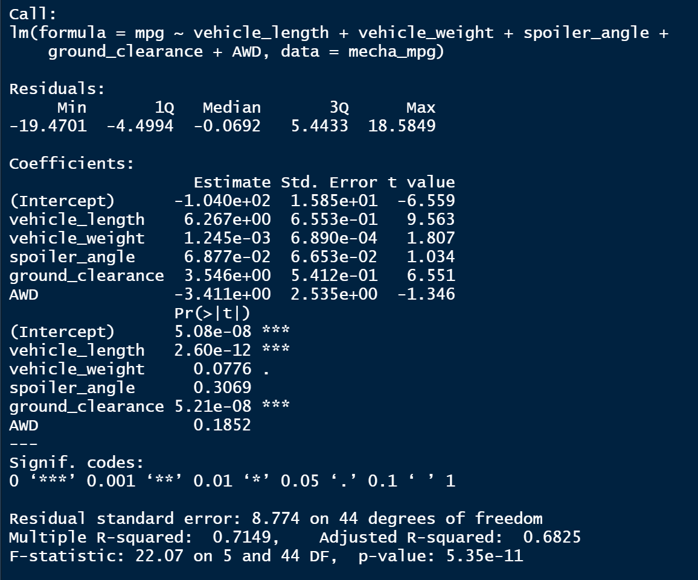
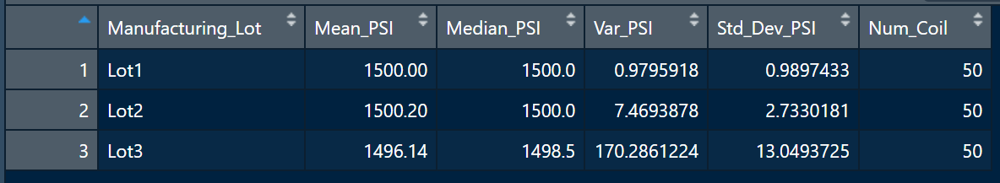

# MechaCar Statistical Analysis

A few weeks after starting his new role, Jeremy is approached by upper management about a special project. AutosRUs’ newest prototype, the MechaCar, is suffering from production troubles that are blocking the manufacturing team’s progress. AutosRUs’ upper management has called on Jeremy and the data analytics team to review the production data for insights that may help the manufacturing team.

In this challenge, we help Jeremy and the data analytics team do the following:

- Perform multiple linear regression analysis to identify which variables in the dataset predict the mpg of MechaCar prototypes
- Collect summary statistics on the pounds per square inch (PSI) of the suspension coils from the manufacturing lots
- Run t-tests to determine if the manufacturing lots are statistically different from the mean population
-  Design a statistical study to compare vehicle performance of the MechaCar vehicles against vehicles from other manufacturers. For each statistical analysis, you’ll write a summary interpretation of the findings.

## Linear Regression to Predict MPG

- Which variables/coefficients provided a non-random amount of variance to the mpg values in the dataset?

Vehicle Lenth and Vehicle ground clearance, statistically likely to provide non-random amounts of variance to the model. 

- Is the slope of the linear model considered to be zero? Why or why not?

The p-Value for this model is 5.35e-11 which is much smaller than the assumed significance level of 0.05% thus is sufficient evidence to reject our null hypothesis. The slope of this linear model is not Zero.

- Does this linear model predict mpg of MechaCar prototypes effectively? Why or why not?
The R-Squared value is 0.7149, which means that 71.5% of all mpg predictions will be determined by this model. The regression model does predict mpg of MechaCar prototypes effectively. 

## Summary Statistics on Suspension Coils

- The design specifications for the MechaCar suspension coils dictate that the variance of the suspension coils must not exceed 100 pounds per square inch. Does the current manufacturing data meet this design specification for all manufacturing lots in total and each lot individually? Why or why not?

In total the meet this design Varience PSI is 62.29 PSI which is well within the 100 PSI. While looking at the 3 lots, lot 1 and 2 both are under the PSI, while when looking at Lot 3 the Varience is 170 PSI. 

In total the meet this design Varience PSI is 62.29 PSI which is well within the 100 PSI. While looking at the 3 lots, lot 1 and 2 both are under the PSI, while when looking at Lot 3 the Varience is 170 PSI. 

## T-Tests on Suspension Coils

The T-test results over all manufacturing lots is 95% confidence interval, where the mean of the sample is 1498.78 with a p-Value of 0.06 which is higher than the common significance of 0.05. There is not enough evidence to support rejecting the null hypothesis. 

Lot 1 has a mean sample of 1500, with a p-value of 1. We cannot reject the null hypothesis since there is not statistical difference between the observed sample mean and the presumed population mean of 1500. 

Lot 2 has a mean sample of 1500.2 with a p-value of 0.6072. The null hypothesis cannot be rejected.

Lot 3 has a mean sample of 1495.14 with a p-value of 0.0417 which is lower than the common significance level of 0.05. Indicating to reject the null hypothesis. 

With the similarities in Lot 1 and 2 we might want to double check lot 3's production cycle. 

## Study Design: MechaCar vs Competition

What metric or metrics are you going to test?
Metrics we could test are Safety Features Ratings, Pricing, Engine type, Fuel Efficiency. 

What is the null hypothesis or alternative hypothesis?
Ho: There is no statistical difference between a competition's mpg and MechaCar's mpg dataset.

Ha: The true mean of MechaCar's mpg is greater than the mean of the competitor's mpg.

What statistical test would you use to test the hypothesis? And why?
I would use the T-Test to compare the dataset. 

What data is needed to run the statistical test?
the p-value would be set to 0.05 and the Datat that results in the prediction of a p-value smaller than 0.05 would prove predictive evidence that the null hypothesis could be rejected. 

